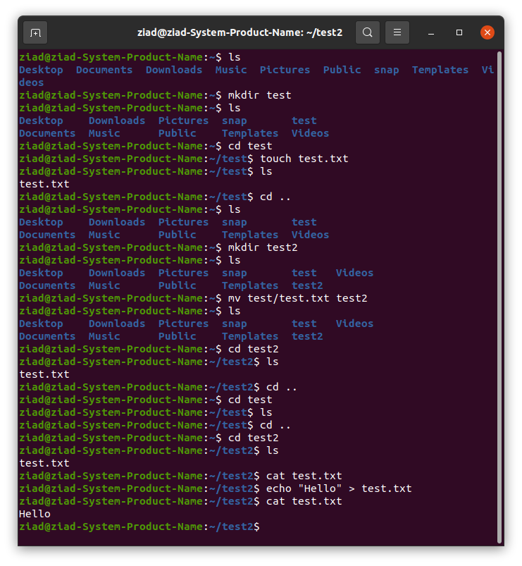

# My First Linux Experience 🐧

## Introduction 🚀
This document records my initial experience with Linux. As a newcomer to the Linux world, I wanted to document my journey and share my thoughts.

## Installation 📥
- Installed Ubuntu 20.04 LTS on my pc.
- The installation process was straight forward and user-friendly.
- Chose a dual-boot setup to keep my existing operating system.

## Exploring the Linux Desktop 💻
- Ubuntu's user interface (UI) felt clean and intuitive.
- I noticed a change in the taskbar, which was different from what I was used to.
- Experimented with the Dash to Panel extension to customize the desktop.

## Terminal Exploration 💡
- Opened the Linux terminal and was initially overwhelmed.
- Learned basic commands like `ls`, `cd`, and `pwd`.
- Used `sudo` for administrative tasks.

  

## Installing Software 📦
- Used the APT package manager to install software.
- Installed vscode and VLC.
- Realized the power of the command line for software management.

## File System 📂
- Explored the Linux file system hierarchy.
- Understood the concept of the root directory ("/") and home directory ("~/").
- Navigated through directories using `cd` and listed files with `ls`.

## Conclusion 🌟
My first Linux experience was both exciting and challenging. I'm looking forward to dive deeper into the world of Linux, learning more commands, and exploring its capabilities.